# Meeting Scheduler - Complete Dataflow Diagram

This document contains a comprehensive dataflow diagram for the Meeting Scheduler Bot application, showing all request types, conditions, thresholds, and decision points.

## Complete Dataflow Architecture

```mermaid
graph TD
    A[User Input] --> B{Input Processing}
    B --> C[Conversation Handler]
    
    %% Intent Classification
    C --> D{Intent Classification<br/>Using Gemini LLM}
    
    %% All Intent Types
    D --> E1[ADD_MEETING]
    D --> E2[DELETE_MEETING]
    D --> E3[VIEW_SCHEDULE/VIEW_CALENDAR]
    D --> E4[CHECK_AVAILABILITY]
    D --> E5[RESCHEDULE_MEETING]
    D --> E6[FIND_MEETINGS]
    D --> E7[CONFIRMATION]
    D --> E8[PROVIDE_INFO]
    D --> E9[GREETING]
    D --> E10[HELP]
    D --> E11[GENERAL_QUERY/UNKNOWN]
    
    %% Confirmation Detection Logic
    B --> CF{Short Response<br/>+ Pending Context?}
    CF -->|Yes + Confirmation Words<br/>yes, yeah, ok, sure, etc.| E7
    CF -->|No| D
    
    %% ADD_MEETING Flow
    E1 --> AM1{Check Mandatory Fields}
    AM1 --> AM2{Missing Fields?<br/>Required: meeting_title,<br/>start_datetime,<br/>duration_minutes,<br/>attendees}
    AM2 -->|Yes| AM3[Store Pending Context<br/>action: ADD_MEETING<br/>missing_info: true]
    AM3 --> AM4[Request Missing Info<br/>via Dynamic Response]
    AM2 -->|No| AM5[Schedule Meeting]
    
    AM5 --> AM6{Check Availability<br/>start_time to end_time}
    AM6 -->|Available| AM7[Create Google Calendar Event]
    AM7 --> AM8{Creation Success?}
    AM8 -->|Yes| AM9[Success Response<br/>Clear Context]
    AM8 -->|No| AM10[Error Response<br/>Clear Context]
    
    AM6 -->|Conflict| AM11[Find Alternative Slots<br/>Same Day → Next Day → Prev Day<br/>Max 3 suggestions]
    AM11 --> AM12[Store Conflict Context<br/>action: ADD_MEETING<br/>conflict: true<br/>suggestions: alternatives]
    AM12 --> AM13[Offer Alternatives Response]
    
    %% DELETE_MEETING Flow
    E2 --> DM1{Meeting Identifier<br/>Provided?}
    DM1 -->|No| DM2[Store Context<br/>action: DELETE_MEETING<br/>needs_identifier: true]
    DM2 --> DM3[Request Meeting ID]
    
    DM1 -->|Yes| DM4[Search Meetings<br/>by Identifier + Date]
    DM4 --> DM5{Matches Found?}
    DM5 -->|None| DM6[No Meetings Found Response]
    DM5 -->|One| DM7[Delete Event from Calendar]
    DM7 --> DM8{Deletion Success?}
    DM8 -->|Yes| DM9[Success Response]
    DM8 -->|No| DM10[Error Response]
    
    DM5 -->|Multiple| DM11[Store Context<br/>multiple_matches: meetings]
    DM11 --> DM12[List Options for Selection]
    
    %% VIEW_SCHEDULE Flow
    E3 --> VS1{Date Specified?}
    VS1 -->|Yes| VS2[Parse Date to ISO format]
    VS1 -->|No| VS3[Default to Today]
    VS2 --> VS4[Get Events for Date Range]
    VS3 --> VS4
    VS4 --> VS5{Events Found?}
    VS5 -->|Yes| VS6[Format Events List<br/>Max 3 attendees shown<br/>Description truncated to 100 chars]
    VS6 --> VS7[Display Schedule Response]
    VS5 -->|No| VS8[No Events Response]
    
    %% CHECK_AVAILABILITY Flow
    E4 --> CA1{Start Time Provided?}
    CA1 -->|No| CA2[Error: Missing Time]
    CA1 -->|Yes| CA3[Parse Start/End Time<br/>Default duration: 60 mins]
    CA3 --> CA4[Check Calendar Conflicts]
    CA4 --> CA5{Conflicts Found?}
    CA5 -->|No| CA6[Available Response]
    CA5 -->|Yes| CA7[Format Conflict Details<br/>Show conflicting meetings]
    CA7 --> CA8[Conflict Response]
    
    %% RESCHEDULE_MEETING Flow
    E5 --> RM1{Meeting ID + New Time?}
    RM1 -->|Missing ID| RM2[Request Meeting Identifier]
    RM1 -->|Missing Time| RM3[Request New Time]
    RM1 -->|Both Present| RM4[Find Meeting by ID]
    RM4 --> RM5{Meeting Found?}
    RM5 -->|No| RM6[Meeting Not Found]
    RM5 -->|Multiple| RM7[Multiple Matches - Clarify]
    RM5 -->|One| RM8[Reschedule Event]
    RM8 --> RM9{Success?}
    RM9 -->|Yes| RM10[Success Response]
    RM9 -->|No| RM11[Error Response]
    
    %% FIND_MEETINGS Flow
    E6 --> FM1[Search Meetings<br/>by Criteria]
    FM1 --> FM2{Results Found?}
    FM2 -->|Yes| FM3[Format Results List]
    FM3 --> FM4[Display Meetings]
    FM2 -->|No| FM5[No Results Response]
    
    %% CONFIRMATION Flow
    E7 --> CO1{Pending Context Exists?}
    CO1 -->|No| CO2[Unknown Confirmation Response]
    CO1 -->|Yes| CO3{Pending Action Type?}
    
    CO3 -->|ADD_MEETING + Missing Info| CO4[Merge New Data<br/>Check Completeness]
    CO4 --> CO5{All Fields Complete?}
    CO5 -->|Yes| AM5
    CO5 -->|No| AM4
    
    CO3 -->|ADD_MEETING + Conflict| CO6[Use Selected Alternative<br/>or Confirm Original Time]
    CO6 --> AM5
    
    CO3 -->|DELETE_MEETING| CO7[Execute Deletion]
    CO7 --> DM7
    
    %% PROVIDE_INFO Flow
    E8 --> PI1{Pending Context?}
    PI1 -->|No| PI2[Context Not Found Response]
    PI1 -->|Yes| PI3{Pending Action?}
    
    PI3 -->|ADD_MEETING| PI4[Extract New Fields<br/>Merge with Existing Data]
    PI4 --> PI5{Complete Now?}
    PI5 -->|Yes| AM5
    PI5 -->|No| AM4
    
    PI3 -->|DELETE_MEETING| PI6[Use Info to Find Meeting]
    PI6 --> DM4
    
    %% Simple Response Flows
    E9 --> GR1[Greeting Response<br/>Clear Context]
    E10 --> HP1[Help Message<br/>List Available Features<br/>Clear Context]
    E11 --> UN1[Unknown Intent Response<br/>Clear Context]
    
    %% Business Rules & Thresholds
    BR1[Business Rules<br/>━━━━━━━━━━━━━━━━<br/>• Business Hours: 9 AM - 5 PM<br/>• Default Duration: 60 minutes<br/>• Max Alternative Suggestions: 3<br/>• Search Days Ahead: 7 days<br/>• Alternative Search: Same Day → Next Day → Previous Day<br/>• Attendee Display Limit: 3<br/>• Description Truncation: 100 chars<br/>• Confirmation Words: yes, yeah, ok, sure, go ahead, etc.<br/>• Short Response Limit: ≤3 words for confirmation detection]
    
    %% Context Management
    CM1[Context Management<br/>━━━━━━━━━━━━━━━━━━━━<br/>• Pending Context Structure:<br/>  - action: string<br/>  - data: extracted_data<br/>  - context: additional_info<br/>• Context Cleared On:<br/>  - Successful completion<br/>  - Greeting<br/>  - Help request<br/>  - Unknown intent<br/>  - Error conditions<br/>• Context Preserved On:<br/>  - Missing information<br/>  - Conflicts requiring resolution<br/>  - Multiple matches needing clarification]
    
    %% API Integration Points
    API1[External APIs<br/>━━━━━━━━━━━━━━━━<br/>• Google Calendar API:<br/>  - list_events<br/>  - create_event<br/>  - delete_event<br/>  - update_event<br/>• Gemini LLM API:<br/>  - Intent classification<br/>  - Data extraction<br/>  - Dynamic response generation<br/>• Timezone Handling:<br/>  - Default: UTC<br/>  - Business hours in local timezone<br/>  - All-day event support]
    
    %% Error Handling
    EH1[Error Handling<br/>━━━━━━━━━━━━━━━━<br/>• API Failures → Graceful degradation<br/>• Invalid dates → Request clarification<br/>• Missing credentials → Authentication error<br/>• Calendar conflicts → Alternative suggestions<br/>• Parsing errors → Fallback responses<br/>• Network issues → Retry logic<br/>• Unknown intents → Help guidance]
    
    %% Styling
    classDef intentClass fill:#e1f5fe,stroke:#01579b,stroke-width:2px
    classDef conditionClass fill:#fff3e0,stroke:#e65100,stroke-width:2px
    classDef actionClass fill:#e8f5e8,stroke:#2e7d32,stroke-width:2px
    classDef errorClass fill:#ffebee,stroke:#c62828,stroke-width:2px
    classDef contextClass fill:#f3e5f5,stroke:#4a148c,stroke-width:2px
    classDef infoClass fill:#e0f2f1,stroke:#00695c,stroke-width:2px
    
    class E1,E2,E3,E4,E5,E6,E7,E8,E9,E10,E11 intentClass
    class AM1,AM2,AM6,AM8,DM1,DM5,DM8,VS1,VS5,CA1,CA5,RM1,RM5,RM9,FM2,CO1,CO3,CO5,PI1,PI3,PI5 conditionClass
    class AM7,AM9,DM7,DM9,VS6,CA6,RM8,RM10,FM3,CO4,CO6,CO7,PI4,PI6 actionClass
    class AM10,DM10,CA2,RM6,RM11,FM5,CO2,PI2,UN1 errorClass
    class AM3,AM12,DM2,DM11,CM1 contextClass
    class BR1,API1,EH1 infoClass
```



## Request Type Details

### 1. ADD_MEETING
**Mandatory Fields**: `meeting_title`, `start_datetime`, `duration_minutes`, `attendees`
**Thresholds**: 
- Business hours: 9 AM - 5 PM
- Default duration: 60 minutes
- Alternative suggestions: Max 3
- Search scope: Same day → Next day → Previous day (if not past)

**Flow Conditions**:
- Missing fields → Request information → Store context
- Time conflict → Find alternatives → Offer suggestions
- Available slot → Create event → Success/Error response

### 2. DELETE_MEETING
**Required**: Meeting identifier (title, time, or description)
**Conditions**:
- No identifier → Request clarification
- Multiple matches → List options for selection
- Single match → Execute deletion
- No matches → Not found response

### 3. VIEW_SCHEDULE/VIEW_CALENDAR
**Optional**: Specific date (defaults to today)
**Processing**:
- Parse relative dates ("tomorrow", "next week")
- Convert ordinal dates ("20th June" → "2025-06-20")
- Format events with truncation (description: 100 chars, attendees: 3 max)

### 4. CHECK_AVAILABILITY
**Required**: `start_datetime`
**Optional**: `duration_minutes` (default: 60), `end_datetime`
**Logic**: Check for overlapping events in specified time range

### 5. RESCHEDULE_MEETING
**Required**: Meeting identifier + new datetime
**Flow**: Find meeting → Validate new time → Update event

### 6. FIND_MEETINGS
**Criteria**: Person email, date range, title keywords
**Scope**: Default 7 days ahead for person-based searches

### 7. CONFIRMATION
**Trigger**: Short responses (≤3 words) + pending context + confirmation words
**Words**: "yes", "yeah", "yep", "ok", "okay", "sure", "go ahead", "proceed", "correct", "right"
**Action**: Execute pending action based on context type

### 8. PROVIDE_INFO
**Purpose**: Handle follow-up information for incomplete requests
**Processing**: Merge new data with pending context, re-evaluate completeness

### 9. GREETING
**Effect**: Clear any pending context, provide welcome message

### 10. HELP
**Response**: List available features, clear pending context

## Context Management Strategy

**Pending Context Structure**:
```json
{
  "action": "ADD_MEETING|DELETE_MEETING|etc.",
  "data": { /* extracted_data */ },
  "context": {
    "missing_info": true,
    "missing_fields": ["field1", "field2"],
    "conflict": true,
    "suggestions": [/* alternative_times */],
    "multiple_matches": [/* meetings */]
  }
}
```

**Context Lifecycle**:
- **Created**: When information is missing or conflicts arise
- **Updated**: When user provides additional information
- **Cleared**: On successful completion, greeting, help, or errors
- **Preserved**: During multi-turn conversations for complex requests

## Integration Points

1. **Google Calendar API**: Event CRUD operations
2. **Gemini LLM**: Intent classification and response generation
3. **Timezone Handling**: UTC default with local business hours
4. **Error Recovery**: Graceful degradation with helpful error messages

This dataflow ensures robust handling of all meeting scheduler scenarios with appropriate fallbacks and user guidance. 